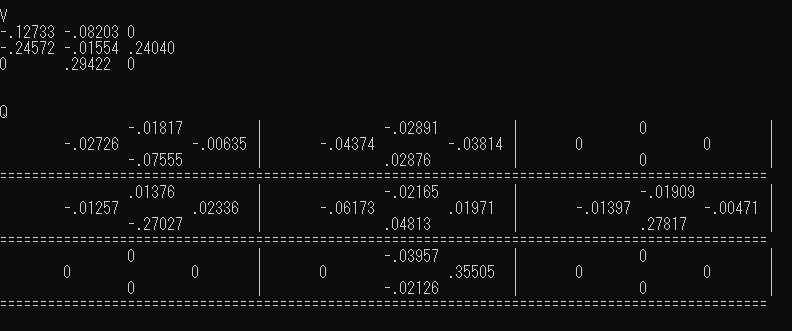
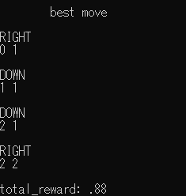

# actor-critic-on-shell

* Simple RL implemented in *Shell Script*

* *Maze* as environment

* *Actor Critic* method

## Setup

1. clone this repo

## Usage

1. change params in *config.txt*, as you like

    * You can change maze in `GRID`

    In `GRID`,

    Symbols | Meaning
    -- | --
    `o` | Goal
    `x` | Fail
    `#` | Block
    others | normal

    as default value

2. run `bash train.sh <MAX_EPISODE>`

    * `MAX_EPISODE` is optional, should be given as integer

    After learning, you may get *V & Q table*, such as
    

    and the best move

    